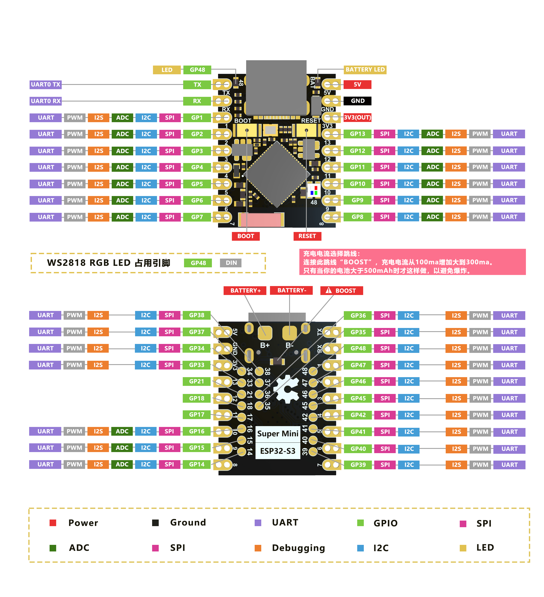
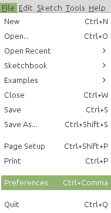
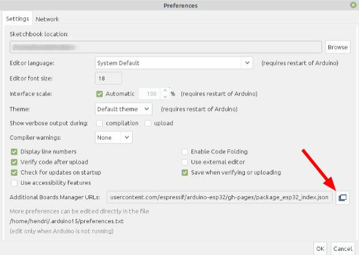
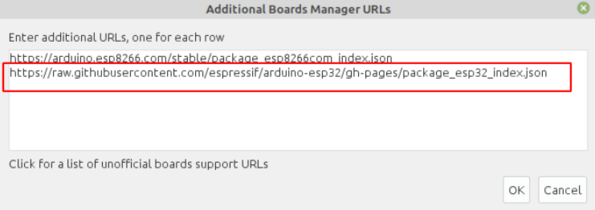
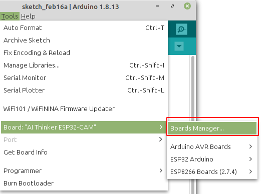
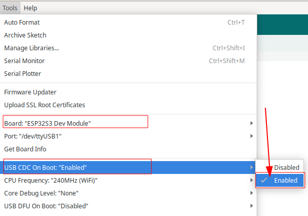
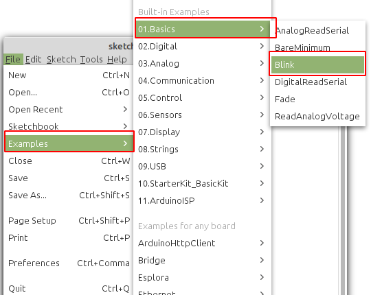
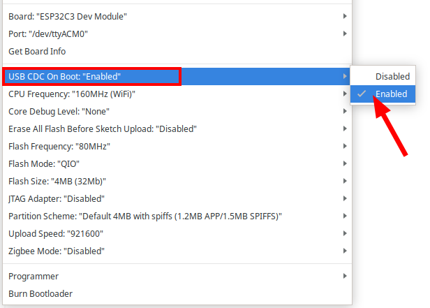

# ESP32 S3 Super Mini




## Install Board

1. Masuk ke preferences



2. Klik Additional Board Manager



3. Tambahkan board esp32 kalimat berikut https://raw.githubusercontent.com/espressif/arduino-esp32/gh-pages/package_esp32_index.json



4. Pilih Tools -> Board -> Board Manager



5. Search ESP32 kemudian klik install


6. Pilih Tools -> Board -> ESP32 -> esp32S3 dev Module


7. Untuk Arduino 2.0 bisa juga Klik board pada main bar


8. kemudian pilih ESP32S3 Dev Module, untuk serial port sesuikan dengan port serial ditempat anda


9. Ubah opsi CDC on Boot menjadi “**enable**”, ini perlu supaya port serial bisa bekerja dengan baik



10. Pilih Example -> Basic -> blink



11. Setting port serial , untuk windows bisa cek device manager, pastikan anda telah install driver serial usb anda


## Contoh Program Serial

Board **ESP32-S3 Super Mini** mendukung komunikasi serial melalui koneksi USB yang memungkinkan pengiriman dan penerimaan data antara mikrokontroler dan komputer. Program berikut memanfaatkan fitur komunikasi serial untuk memberikan informasi status LED (ON/OFF) secara real-time ke *Serial Monitor*.

Sebelum menjalankan program ini, pastikan untuk mengaktifkan opsi **USB CDC on Boot** melalui pengaturan pada menu **Tools** di Arduino IDE agar komunikasi serial dapat berjalan dengan baik. Pengaturan ini memastikan board dapat menggunakan port USB internal untuk komunikasi serial.



### Fitur Program:

1. Mengontrol LED internal pada **GPIO 48** untuk menyala dan mati secara bergantian.
2. Mengirimkan status LED ("ON" atau "OFF") ke *Serial Monitor* pada kecepatan komunikasi 9600 baud.

Berikut adalah kode lengkapnya:

```c++
#include <Arduino.h>
int led = 48;

void setup() {
  // initialize digital pin led as an output
  pinMode(led, OUTPUT);
  Serial.begin(9600);
}

void loop() {
  digitalWrite(led, LOW);    // turn the LED on
  delay(100);               // wait for a second
  Serial.println("OFF");
  digitalWrite(led, HIGH);   // turn the LED off
  delay(1000);               // wait for a second
  Serial.println("ON");
}
```

###  Penjelasan Program:

1. **Pin GPIO**:  pin `led` menunjuk ke GPIO 48, tempat LED internal terhubung.

2. **Fungsi `Serial.begin(9600)`**: Mengaktifkan komunikasi serial pada baud rate 9600. Fungsi ini memungkinkan board mengirimkan data melalui port USB ke komputer.

3. **Fungsi `Serial.println()`**: Mengirimkan string teks ke *Serial Monitor*. Program ini mengirimkan "ON" ketika LED mati dan "OFF" ketika LED menyala.

4. Siklus `loop()`

   :

   - Menyalakan LED (`LOW`) selama 100 ms.
   - Mengirimkan teks "OFF" ke *Serial Monitor*.
   - Mematikan LED (`HIGH`) selama 1 detik.
   - Mengirimkan teks "ON" ke *Serial Monitor*.

## Upload program

Bila tampilan seperti ini maka anda harus mengkonfigurasi ESP32 anda agar bisa melakukan download

```
- ---esptool.py v3.0-dev
- ---Serial port COM…
- ---Connecting........_____....._____.....__
```
Langkah yang harus dilakukan

- Tekan dan tahan tombol Boot/0  
- Klik(tekan dan lepas) tombol reset/EN sambil tetap tekan tombol Boot .
- Lepas tombol boot
- Klik tombol upload pada Arduino IDE, bila sukses akan menampilkan info

```cpp
- ---Compressed 261792 bytes to 122378...
- ---Writing at 0x00010000... (12 %)
- ---Writing at 0x00014000... (25 %)
- ---Writing at 0x00018000... (37 %)
```
- Setelah selesai Wajib klik tombol **reset** sekali lagi untuk berpindah dari mode download menjadi mode run

> [!NOTE]  
> INGAT YA WAJIB Di Klik Tombol RESET setelah proses upload selesai, tanpa itu program yang baru diupload tidak akan dijalankan
## Langkah Pengujian:

1. Unggah program ke board **ESP32-S3 Super Mini**.

2. Buka *Serial Monitor* di Arduino IDE dengan kecepatan komunikasi 9600 baud.

3. Amati status LED yang ditampilkan pada 

   Serial Monitor

   :

   - **"OFF"** saat LED menyala.
   - **"ON"** saat LED mati.

Program ini merupakan contoh sederhana namun sangat efektif untuk mempelajari komunikasi serial dan mengintegrasikannya dengan kontrol perangkat keras seperti LED. Selamat mencoba! 🚀


## Pemecahan Masalah

### A. Port Com  tidak dapat dikenali di Arduino

Masuk ke mode unduh: 

- Tekan dan tahan tombol Boot/0  
- Klik(tekan dan lepas) tombol reset/EN sambil tetap tekan tombol Boot .
- Lepas tombol boot
- Setelah selesai Wajib klik tombol **reset** sekali lagi untuk berpindah dari mode download menjadi mode run

### B. Program tidak dapat berjalan setelah diunggah

Setelah upload berhasil, Anda perlu menekan tombol Reset sebelum dapat dijalankan.

### C. Port serial di Arduino tidak dapat mencetak
Anda perlu mengatur USB CDC On Boot di toolbar untuk diaktifkan.

**Referensi**

- https://www.nologo.tech/product/esp32/esp32s3supermini/esp32S3SuperMini.html#%E8%BD%AF%E4%BB%B6%E8%AE%BE%E7%BD%AE