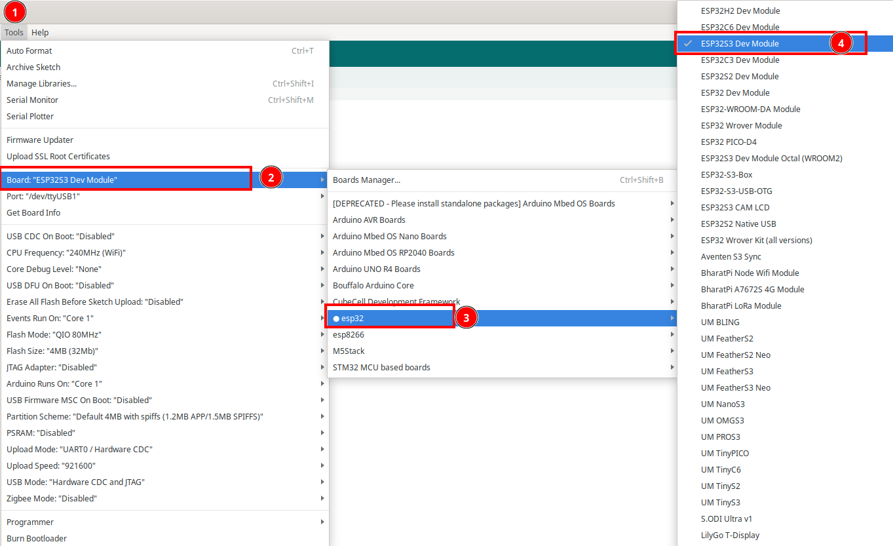
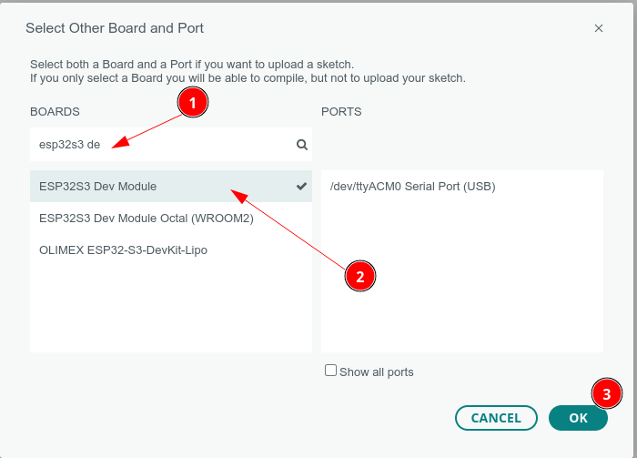
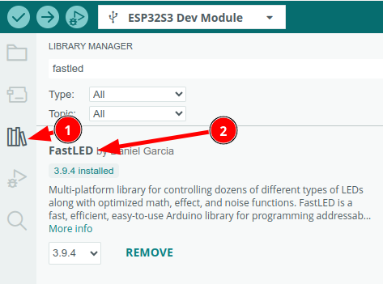

# ESP32 S3 Super Mini


## Install Board

1. Masuk ke preferences


2. Klik Additional Board Manager


3. Tambahkan board esp32 kalimat berikut https://raw.githubusercontent.com/espressif/arduino-esp32/gh-pages/package_esp32_index.json


4. Pilih Tools -> Board -> Board Manager


5. Search ESP32 kemudian klik install


6. Pilih Tools -> Board -> ESP32 -> esp32S3 dev Module



7. Untuk Arduino 2.0 bisa juga Klik board pada main bar


8. kemudian pilih ESP32S3 Dev Module, untuk serial port sesuikan dengan port serial ditempat anda



9. Ubah opsi CDC on Boot menjadi “**enable**”, ini perlu supaya port serial bisa bekerja dengan baik


10. Pilih Example -> Basic -> blink


11. Setting port serial , untuk windows bisa cek device manager, pastikan anda telah install driver serial usb anda


## Contoh Program Serial

Board **ESP32-S3 Super Mini** mendukung komunikasi serial melalui koneksi USB yang memungkinkan pengiriman dan penerimaan data antara mikrokontroler dan komputer. Program berikut memanfaatkan fitur komunikasi serial untuk memberikan informasi status LED (ON/OFF) secara real-time ke *Serial Monitor*.

Sebelum menjalankan program ini, pastikan untuk mengaktifkan opsi **USB CDC on Boot** melalui pengaturan pada menu **Tools** di Arduino IDE agar komunikasi serial dapat berjalan dengan baik. Pengaturan ini memastikan board dapat menggunakan port USB internal untuk komunikasi serial.


### Fitur Program:

1. Mengontrol LED internal pada **GPIO 48** untuk menyala dan mati secara bergantian.
2. Mengirimkan status LED ("ON" atau "OFF") ke *Serial Monitor* pada kecepatan komunikasi 9600 baud.

Berikut adalah kode lengkapnya:

```c++
#include <Arduino.h>
int led = 48;

void setup() {
  // initialize digital pin led as an output
  pinMode(led, OUTPUT);
  Serial.begin(9600);
}

void loop() {
  digitalWrite(led, LOW);    // turn the LED on
  delay(100);               // wait for a second
  Serial.println("OFF");
  digitalWrite(led, HIGH);   // turn the LED off
  delay(1000);               // wait for a second
  Serial.println("ON");
}
```

###  Penjelasan Program:

1. **Pin GPIO**:  pin `led` menunjuk ke GPIO 48, tempat LED internal terhubung.

2. **Fungsi `Serial.begin(9600)`**: Mengaktifkan komunikasi serial pada baud rate 9600. Fungsi ini memungkinkan board mengirimkan data melalui port USB ke komputer.

3. **Fungsi `Serial.println()`**: Mengirimkan string teks ke *Serial Monitor*. Program ini mengirimkan "ON" ketika LED mati dan "OFF" ketika LED menyala.

4. Siklus `loop()`

   :

   - Menyalakan LED (`LOW`) selama 100 ms.
   - Mengirimkan teks "OFF" ke *Serial Monitor*.
   - Mematikan LED (`HIGH`) selama 1 detik.
   - Mengirimkan teks "ON" ke *Serial Monitor*.

## Upload program

Bila tampilan seperti ini maka anda harus mengkonfigurasi ESP32 anda agar bisa melakukan download

```
- ---esptool.py v3.0-dev
- ---Serial port COM…
- ---Connecting........_____....._____.....__
```
Langkah yang harus dilakukan

- Tekan dan tahan tombol Boot/0  
- Klik(tekan dan lepas) tombol reset/EN sambil tetap tekan tombol Boot .
- Lepas tombol boot
- Klik tombol upload pada Arduino IDE, bila sukses akan menampilkan info

```cpp
- ---Compressed 261792 bytes to 122378...
- ---Writing at 0x00010000... (12 %)
- ---Writing at 0x00014000... (25 %)
- ---Writing at 0x00018000... (37 %)
```
- Setelah selesai Wajib klik tombol **reset** sekali lagi untuk berpindah dari mode download menjadi mode run

> [!NOTE]  
> INGAT YA WAJIB Di Klik Tombol RESET setelah proses upload selesai, tanpa itu program yang baru diupload tidak akan dijalankan
## Langkah Pengujian:

1. Unggah program ke board **ESP32-S3 Super Mini**.

2. Buka *Serial Monitor* di Arduino IDE dengan kecepatan komunikasi 9600 baud.

3. Amati status LED yang ditampilkan pada 

   Serial Monitor

   :

   - **"OFF"** saat LED menyala.
   - **"ON"** saat LED mati.

Program ini merupakan contoh sederhana namun sangat efektif untuk mempelajari komunikasi serial dan mengintegrasikannya dengan kontrol perangkat keras seperti LED. Selamat mencoba! 🚀

## Contoh Program akses LED WS2812 di GPIO48

Program ini dirancang untuk menghasilkan efek gradien warna halus pada LED WS2812 menggunakan pustaka FastLED.  Dengan memanfaatkan model warna HSV, warna akan berubah secara perlahan dalam siklus pelangi.

Pastikan anda telah menginstall library Fastled. untuk Arduino 2.x dilakukan dengan cara klik icon library kemudian search fastled, setelah itu install



Program berikut akan  terus memperbarui warna LED berdasarkan nilai `hue`, yang berubah dari 0 ke 255 dan kembali ke 0 dalam sebuah siklus.

Efek ini memberikan transisi warna yang lembut, karena model warna HSV mendukung perpindahan antar-warna secara kontinu.

```c++
#include "FastLED.h"

#define NUM_LEDS 1       // Jumlah LED yang digunakan
#define DATA_PIN 48      // Pin Data untuk kontrol LED
#define LED_TYPE WS2812  // Tipe LED yang digunakan (WS2812/Neopixel)
#define COLOR_ORDER GRB  // Urutan warna pada LED (Green-Red-Blue)

// Variabel untuk mengontrol kecerahan LED (range: 0-255)
uint8_t max_bright = 128;

// Membuat array untuk menyimpan data LED
CRGB leds[NUM_LEDS];

// Variabel untuk gradien warna
uint8_t hue = 0;  // Nilai hue awal (0-255, siklus warna pelangi)

void setup() {
    // Inisialisasi LED strip dengan konfigurasi yang telah ditentukan
    FastLED.addLeds<LED_TYPE, DATA_PIN, COLOR_ORDER>(leds, NUM_LEDS);

    // Mengatur tingkat kecerahan LED
    FastLED.setBrightness(max_bright);
}

void loop() {
    // Mengatur warna LED berdasarkan nilai hue
    leds[0] = CHSV(hue, 255, 255); // CHSV(hue, saturation, value)

    // Memperbarui tampilan LED
    FastLED.show();

    // Increment nilai hue untuk transisi warna (0-255, lalu kembali ke 0)
    hue++;

    // Delay untuk memperhalus transisi warna
    delay(20); // Semakin kecil nilai, semakin cepat transisi gradien
}
```


## Contoh Program WS2812 simple

Program ini dibuat untuk mengontrol LED WS2812 menggunakan pustaka **FastLED**. WS2812 adalah jenis LED RGB yang dapat dikontrol secara individu untuk menghasilkan warna yang beragam. Dalam program ini, Anda dapat mengatur:

1. **Jumlah LED**: Diatur menggunakan `NUM_LEDS`.
2. **Pin Data**: Pin yang digunakan untuk mengontrol LED, dalam hal ini `DATA_PIN`.
3. **Kecerahan**: Diatur dengan variabel `max_bright`.

Program ini mengimplementasikan logika sederhana di mana:

- LED menyala dengan warna **hijau** pada salah satu posisi LED.

​	``` leds[i] = CRGB::Green; ```

- Bila diinginkan warna merah tinggal mengganti kode seperti ini
 ``` leds[i] = CRGB::Red; ```
- Setelah 1 detik, LED mati, dan kemudian melanjutkan ke posisi berikutnya.
- Efek ini menciptakan ilusi seperti "berpindah-pindah cahaya hijau" jika lebih dari satu LED digunakan

```c++
#include "FastLED.h"

#define NUM_LEDS 1       // Jumlah LED yang digunakan
#define DATA_PIN 48      // Pin Data untuk kontrol LED (dapat diganti sesuai kebutuhan: 38, 16, 8, dll)
#define LED_TYPE WS2812  // Tipe LED yang digunakan (WS2812/Neopixel)
#define COLOR_ORDER GRB  // Urutan warna pada LED (Green-Red-Blue)

// Variabel untuk mengontrol kecerahan LED (range: 0-255)
// Semakin besar nilai, semakin terang LED
uint8_t max_bright = 128;  

// Membuat array untuk menyimpan data LED
CRGB leds[NUM_LEDS];     

// Variabel untuk menghitung urutan LED yang menyala
char i = 0;              

void setup() {
    // Inisialisasi LED strip dengan konfigurasi yang telah ditentukan
    LEDS.addLeds<LED_TYPE, DATA_PIN, COLOR_ORDER>(leds, NUM_LEDS);
    
    // Mengatur tingkat kecerahan LED
    FastLED.setBrightness(max_bright);
}

void loop() {
    // Reset counter jika sudah mencapai LED terakhir
    if (i == NUM_LEDS) {
        i = 0;
    }
    
    // Menyalakan LED dengan warna Hijau
    leds[i] = CRGB::Green;
    
    // Memperbarui tampilan LED
    FastLED.show();
    
    // Jeda 50 milidetik
    delay(1000);
    
    // Mematikan LED (warna hitam = LED mati)
    leds[i] = CRGB::Black;
    
    // Memperbarui tampilan LED
    FastLED.show();
    
    // Jeda 50 milidetik
    delay(50);
    
    // Pindah ke LED berikutnya
    i++;
}
```

> [!NOTE]
>
> Pada board terdapat 2 LED yaitu LED biasa dan LED RGB WS2812 yang punya port yang sama (GPIO48). bila terdapat program yang mengakses GPIO48 dengan library WS2812 maka  hanya LED WS2812 yang akan merespon, bila terdapat program blinky biasa , maka LED biasa yang merespon


## Pemecahan Masalah

### A. Port Com  tidak dapat dikenali di Arduino

Masuk ke mode unduh: 

- Tekan dan tahan tombol Boot/0  
- Klik(tekan dan lepas) tombol reset/EN sambil tetap tekan tombol Boot .
- Lepas tombol boot
- Setelah selesai Wajib klik tombol **reset** sekali lagi untuk berpindah dari mode download menjadi mode run

### B. Program tidak dapat berjalan setelah diunggah

Setelah upload berhasil, Anda perlu menekan tombol Reset sebelum dapat dijalankan.

### C. Port serial di Arduino tidak dapat mencetak
Anda perlu mengatur USB CDC On Boot di toolbar untuk diaktifkan.

**Referensi**

- https://www.nologo.tech/product/esp32/esp32s3supermini/esp32S3SuperMini.html#%E8%BD%AF%E4%BB%B6%E8%AE%BE%E7%BD%AE